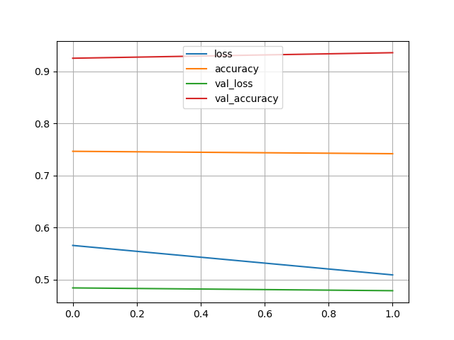
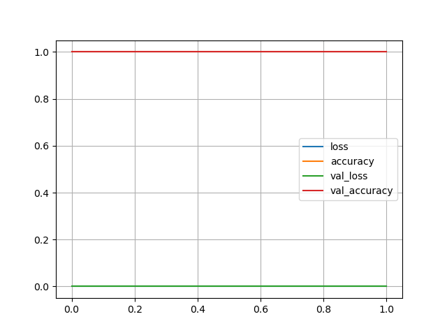

# Project: Bird Species Classifier
This project aims to classify two bird species 'Psilopogon nuchalis' and 'Pycnonotus sinensis' accurately, with which is based on the images I provided. Due to low level devices, the file posted on GitHub can only demonstrated a dataset size of 311. However, this project is designed to contain considerable images and therefore database and cluster method is applied to tackle with situations of large sample size.
This a photo of 'Psilopogon nuchalis'.(also known as Taiwan barbet)

This a photo of 'Pycnonotus sinensis'.

## Database
We expect to introduce two databases into this project. MongoDB is implemented owing to its outstanding extendability and we store images and labels here. MySQL is planned to be used to collect metadata from images thereselves; however, I did not put it in use since the image data itself is the core I want to process.

## Method
Since I expect to afford large image data when conditions are available, label propagation with K-Means is used to pick samples that are more representative. After selecting quality samples, we input our images data (256x256x3) into CNN.

## Performance
The performances on two dataset(the reduced dataset and the entire dataset) are almost identically perfect. However, it is worth noticing that CNN with the reduced dataset use less epoch to accomplish the task whereas the entire dataset use more epoches and more time per epoch. When we enlarge the dataset, the difference will become more significant.

The performance of models of full dataset and reduced dataset is shown as below, respectively:

## Instruction
Since the image dataset is under maintenance, it is not available to enclose it with this project on GitHub. However, if interested, readers are encouraged to download the ipynb file I provided with and utilize it with your own dataset. 
